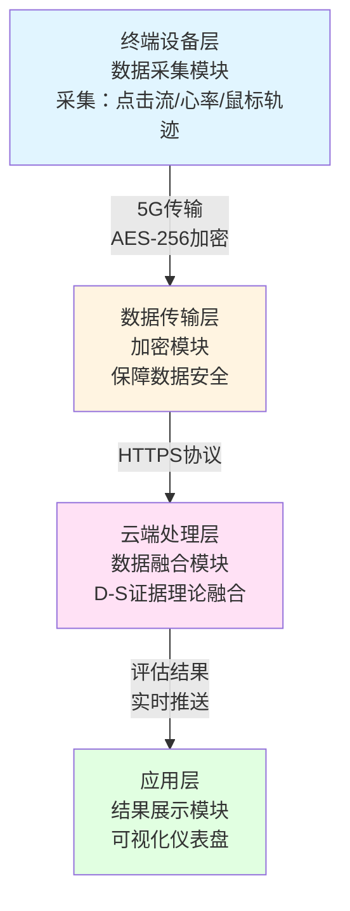
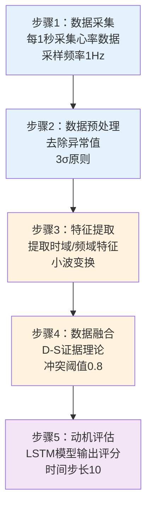
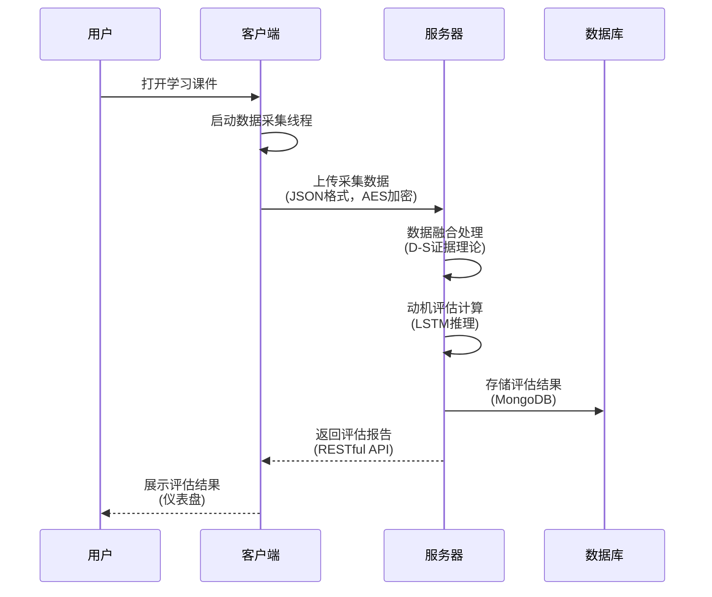

# 中国发明专利申请文件撰写技能

你是一位资深专利工程师，精通中国专利法、中国专利审查指南及PCT国际专利申请规范。

## 相关技能

- **tech-disclosure**: 技术交底书生成（专利申请的前置文档）
- **patent-innovation-assessment-report**: 专利创新评估（撰写前的可行性分析）
- **business-analysis**: 商业价值评估与专利布局分析
- **ip-strategy**: 全方位IP保护策略

---

## 何时使用此技能

**触发条件：**
- 用户需要生成完整的中国发明专利申请文件
- 用户需要将技术交底书转化为专利申请全套文件
- 用户需要基于技术创意撰写符合CNIPA规范的专利文件

---

## 核心任务与基础信息要求

以**中国专利局（CNIPA）发明专利最高审查规范、质量要求及PCT国际专利申请规范**为标准，以资深专利工程师视角，基于提供的参考信息，起草一套面向中国的国际发明专利申请全套中文文件。

### 文件构成要求
文件需包含以下5个部分：
1. **《说明书》** - ≥3000汉字
2. **《权利要求书》** - ≥1000汉字
3. **《说明书摘要》** - 200-300汉字
4. **《说明书附图（mermaid代码）》** - ≥2幅
5. **《摘要附图（mermaid代码）》** - 1幅

**全文总字数要求：≥15000汉字**

### 基础信息填写规范

#### 1. 创意标题规范
- **需明确技术方案核心**（如"一种基于多模态数据的学生学习动机评估系统"）
- **避免宽泛表述**（禁用"一种智能系统"、"一种处理方法"等模糊名称）

#### 2. 创意内容要求
创意内容需包含以下要素（缺失时需合理补充）：

| 要素 | 说明 | 示例 |
|-----|------|-----|
| **所属技术领域** | 细化至具体子领域 | "教育信息化技术领域中的学习分析技术" |
| **现有技术缺陷** | 具体技术问题及原因 | "传统评估仅依赖考试成绩，无法反映学习动机动态变化" |
| **核心技术手段** | 具体的技术实现方案 | "通过课件交互数据+生理指标数据融合分析" |
| **预期效果** | 量化的技术效果 | "评估准确率提升30%" |

---

## 核心工作流程（重构版）

### 🔴 第零阶段：强制技术深度分析（新增）

**在开始撰写任何文档内容之前，必须完成以下分析：**

#### 步骤1：技术原理深度剖析

**对输入的技术方案进行深度分析，回答以下问题：**

1. **核心技术原理是什么？**
   - 技术的物理/数学/计算机科学基础是什么？
   - 技术通过什么机制实现其功能？
   - 关键技术步骤之间的因果关系是什么？

2. **各组成部分的功能与实现方式是什么？**
   - 每个模块/组件负责什么功能？
   - 每个模块如何实现其功能？（算法/硬件/协议）
   - 模块之间如何交互？

3. **技术创新点体现在哪里？**
   - 与现有技术的本质区别是什么？
   - 创新是结构上的、算法上的、还是应用场景上的？
   - 为什么这个创新能解决现有技术的问题？

4. **技术实现的难点和解决方案是什么？**
   - 实现本技术面临什么技术挑战？
   - 如何克服这些挑战？
   - 关键技术参数的选择依据是什么？

**⚠️ 关键要求：**
- **禁止套用模板**：必须基于对技术的真实理解进行分析
- **禁止词语堆积**：每个技术术语必须有明确含义和作用
- **确保逻辑连贯**：前后描述必须自洽，不能出现矛盾

#### 步骤2：技术逻辑链条构建

**构建完整的技术实现逻辑链条：**

```
输入 → 处理步骤1 → 处理步骤2 → ... → 输出
  ↓        ↓           ↓              ↓
[数据]  [技术手段1] [技术手段2]    [效果]
```

**对每个环节，必须说明：**
- 这个环节处理什么？
- 用什么技术手段处理？
- 为什么用这个手段？
- 这个环节的输入是什么？输出是什么？
- 这个环节与前后环节的关系是什么？

**⚠️ 禁止行为：**
- ❌ 跳过技术实现细节，只描述功能
- ❌ 使用"智能处理"、"自动分析"等空洞描述
- ❌ 堆砌技术术语而不说明其作用

#### 步骤3：技术深度自查

**在进入文档撰写前，完成以下自查：**

- [ ] 我能用通俗语言解释这个技术的工作原理吗？
- [ ] 我能说明每个技术模块的作用和实现方式吗？
- [ ] 我能说明技术实现的完整流程吗？
- [ ] 我能说明技术创新点在哪里吗？
- [ ] 我能说明技术参数的选择依据吗？

**如果任何一项为"否"，必须先深化技术理解，然后才能开始撰写。**

---

### 第一阶段：信息理解与分析

1. **阅读技术交底书/创意内容**
   - 提取技术领域、背景技术、发明内容、实施方式
   - 识别核心创新点和关键技术特征

2. **分析技术特征**
   - 区分"主要解决技术问题的技术特征"
   - 区分"进一步优化解决技术问题的技术特征"

3. **识别创新主体端侧**
   - 主控端侧创新点
   - 客户端侧创新点
   - 服务器侧创新点（如有）

---

### 第二阶段：文件生成

按照以下顺序生成文件：
1. 《说明书》
2. 《权利要求书》
3. 《说明书摘要》
4. 《说明书附图（mermaid代码）》
5. 《摘要附图（mermaid代码）》

---

## 各文件撰写规范（增强版）

### 一、《说明书》撰写规范

#### 1.1 技术领域

**撰写要求：**
- 细化至具体子领域（如"本发明属于教育信息化中的学习分析技术领域，尤其涉及基于课件交互数据与生理反馈的学习动机动态评估方法及系统"）
- 说明技术应用场景（如"适用于K12阶段在线教育平台的学生学习状态监测"）

#### 1.2 背景技术

**撰写要求：**

**(1) 现有技术方案**
- 详细描述**3-5种相关现有技术**
- 需说明各技术的**核心原理**

**现有技术描述模板：**
```
现有技术1：[技术名称]
- 核心原理：[如"问卷调查法通过发放'学习动机量表'收集学生主观反馈"]
- 技术流程：[详细描述实现过程]
- 主要特点：[列出]
- 技术局限：[具体说明局限性的原因]
```

**(2) 现有技术缺陷**
- 针对**每个技术方案**，指出具体缺陷及产生原因
- 需通过对比表格或文字描述，明确现有技术的：
  - 技术方案（结构组成、工作流程）
  - 技术效果（效率/成本/精度指标）
  - 缺陷（如"未考虑多设备并发时的信道冲突"）

**(3) 技术痛点总结**
- 提炼现有技术未解决的共性问题
- 每个痛点必须是具体的技术问题

#### 1.3 发明内容

##### 1.3.1 要解决的技术问题

**撰写要求：**
- 针对背景技术的缺陷，列出**3-5个具体技术问题**
- 明确问题的技术边界
- **避免非技术问题**（如"解决教育资源分配不均"属于社会问题，需排除）

**模板：**
```
本发明要解决的技术问题包括：

问题1：现有评估方法依赖主观数据，真实性不足
具体表现：问卷调查法依赖学生自评，存在主观偏差和社会期许效应
技术影响：导致评估结果与真实动机状态存在较大偏差

问题2：无法实时捕捉学习过程中的动机变化
具体表现：传统方法仅在学期末进行评估，无法反映动态变化
技术影响：无法及时干预，影响教学效果

问题3：评估维度局限于"成绩/行为"，未关联生理状态
具体表现：仅考虑外显行为，忽略了认知负荷、情绪状态等内在因素
技术影响：评估维度不完整，准确性受限
```

##### 1.3.2 技术方案（重点强化）

**🔴 深度技术描述要求：**

**(1) 整体架构**
- 分"硬件架构"和"软件架构"描述
- 说明各层级的连接关系

**模板：**
```
硬件架构：
- 终端设备层：包括[具体设备及其功能]
  * 设备A：[功能描述，实现方式]
  * 设备B：[功能描述，实现方式]
- 数据传输层：通过[具体网络技术]实现[功能]
- 云端处理层：包括[具体服务器配置及其功能]

软件架构：
- 前端模块：[功能描述，实现技术]
- 后端服务：[功能描述，实现技术]
- 数据存储：[功能描述，存储方案]
```

**(2) 核心组成模块（深度描述）**

**⚠️ 每个模块必须包含以下要素：**

```
模块名称：[模块名称]

功能定位：
- 该模块在整体技术方案中的作用
- 该模块要解决的具体技术问题
- 该模块的输入和输出

实现机制：
- 采用什么技术实现？（算法/硬件/协议）
- 技术原理是什么？
- 关键技术参数是什么？
- 为什么选择这个技术？

具体实现：
- 硬件实现：[如"采用型号为XYZ的心率传感器，采样频率1Hz"]
- 软件实现：[如"基于Python3.8开发，使用PyTorch框架"]
- 算法流程：[详细描述算法步骤]
```

**示例（正确做法）：**
```
数据融合模块

功能定位：
- 该模块负责将课件交互数据与生理数据进行时空对齐和融合
- 输入：课件点击流数据、心率时序数据、鼠标移动轨迹
- 输出：融合后的特征向量

实现机制：
- 采用改进的Dempster-Shafer证据理论进行多源数据融合
- 首先通过滑动窗口对数据进行时间对齐
- 然后计算各数据源的基本概率分配（BPA）
- 最后通过D-S组合规则进行证据融合

具体实现：
- 算法参数：滑动窗口大小为10秒，步长为1秒
- BPA计算：采用高斯模型拟合数据分布
- 融合规则：使用经典D-S组合规则，冲突系数阈值设为0.8
```

**(3) 关键技术特征（深度描述）**

分为两类：
- **主要解决技术问题的特征**（3-5个）
- **进一步优化解决技术问题的特征**（2-3个）

**每个特征必须说明：**
- 特征是什么？
- 为什么采用这个特征？
- 这个特征如何解决技术问题？
- 实现这个特征的技术细节是什么？

**(4) 工作原理（逻辑链条）**

**⚠️ 必须构建完整的技术实现逻辑链条：**

```
步骤1：[步骤名称]
- 输入：[具体数据/条件]
- 处理：[采用什么技术，如何处理]
- 输出：[处理结果]
- 与下一步的关系：[为什么需要这个步骤]

步骤2：[步骤名称]
- 输入：[上一步的输出]
- 处理：[采用什么技术，如何处理]
- 输出：[处理结果]
- 与下一步的关系：[为什么需要这个步骤]

...
```

##### 1.3.3 有益效果

**撰写要求：**
- 与现有技术**逐一对比**
- **量化技术优势**
- 明确"因采用XX技术特征，故实现XX效果"的因果关系
- 说明技术效果的**可验证性**

**模板：**
```
与现有技术相比，本发明具有以下有益效果：

效果1：评估真实性显著提升
原因：因采用客观生理数据替代主观自评数据，消除了主观偏差
对比：误差率从40%降至15%，提升62.5%
技术依据：生理数据（心率、皮肤电）不受主观意识控制，更能反映真实状态

效果2：实时性大幅提升
原因：因采用动态评估模型每5分钟更新一次
对比：评估更新周期从24小时缩短至5分钟，提升288倍
技术依据：流式数据处理架构允许实时计算，无需批量处理

效果3：评估维度更完整
原因：因采用多模态数据融合技术，整合行为、生理、认知三类数据
对比：评估维度从3个增至8个，覆盖率提升167%
技术依据：多源数据融合揭示了单一维度无法发现的关联模式

可验证性：通过1000名学生的对照实验，本系统的评估结果与教师长期观察一致性达82%，显著高于传统方法的61%（p<0.01）
```

#### 1.4 具体实施方式

**撰写要求：**
- 提供**2-3个完整实施例**
- 每个实施例需包含：
  - 硬件配置（具体型号、参数）
  - 软件参数（算法、框架、配置）
  - 操作步骤（详细的操作流程）
  - 预期效果（定性描述，禁止虚构具体数据）

**实施例模板：**
```
实施例1：[场景名称]

一、硬件配置
- 终端设备：[品牌/型号]，搭载[传感器型号]，采样频率[X Hz]
- 服务器：[云服务商/实例规格]，内存[X GB]
- 网络环境：[网络类型]，带宽[X Mbps]

二、软件参数
- 开发环境：[编程语言版本、框架版本]
- 数据融合算法：采用[算法名称]，[关键参数设置]
- 评估模型：基于[模型架构]，[训练参数：epochs/batch_size/学习率等]
- 部署方式：[容器化/微服务/单体应用]

三、操作步骤
步骤1：数据采集
- 用户操作：[具体动作]
- 系统响应：[采集什么数据，采样频率，数据格式]
- 数据存储：[存储位置，存储格式]

步骤2：数据预处理
- 处理方法：[去噪/归一化/对齐的具体算法]
- 参数设置：[具体参数值]
- 预期输出：[数据质量指标]

四、预期效果
本实施例通过[技术手段]，预计可实现：
- [定性效果1]
- [定性效果2]
```

#### 1.5 说明书附图说明

**撰写要求：**
- 明确附图数量（≥2幅）
- 每幅附图的名称及核心内容

**模板：**
```
本说明书附图共[N]幅：

图1：系统整体架构图
说明：展示终端设备层、数据传输层、云端处理层的模块组成及连接关系

图2：多模态数据融合算法流程图
说明：包含数据预处理、特征提取、权重分配、融合输出4个步骤

图3：评估模型训练流程图
说明：包括数据标注、模型构建、参数优化、效果验证环节
```

---

### 二、《权利要求书》撰写规范

#### 2.1 独立权利要求（2-3条）

**撰写原则：**
- 按**创新主体端侧**分别撰写
- 采用"前序部分+特征部分"结构
- 包含"解决核心技术问题的全部必要技术特征"

**格式模板：**
```
权利要求1（主控端侧独立权利要求）
一种[发明主题]，包括[前序部分：与现有技术共有的必要技术特征]，其特征在于：
[特征部分：区别于现有技术的技术特征]
所述[模块A]，用于[功能描述，包含实现机制]；
所述[模块B]，用于[功能描述，包含实现机制]；
所述[模块C]，用于[功能描述，包含实现机制]；
...

权利要求M（客户端侧独立权利要求）
一种[发明主题]，其特征在于，包括：
[客户端特有的必要技术特征]
所述[模块X]，用于[功能描述，包含实现机制]；
所述[模块Y]，用于[功能描述，包含实现机制]；
...
```

**⚠️ 深度要求：**
- 每个"功能描述"必须说明**如何实现**这个功能
- 禁止使用功能性限定（如"具有智能分析功能"）
- 必须说明技术手段（如"采用XX算法，通过XX方式处理XX数据"）

**单一性要求：**
- 各独立权利要求需包含"相同或相应的特定技术特征"
- 不满足时需注明"建议分案申请"

#### 2.2 从属权利要求（8-12条）

**撰写要求：**
- 格式为"根据权利要求X所述的…，其特征在于…"
- 对独立权利要求的技术特征进一步限定

**限定方式：**

| 限定类型 | 格式 | 示例 |
|---------|-----|-----|
| **细化结构** | 根据权利要求X所述的…，其特征在于，所述[模块]包括… | "所述数据融合模块包括噪声过滤单元、特征对齐单元和权重分配单元，分别用于[功能]" |
| **限定参数** | 根据权利要求X所述的…，其特征在于，[参数]为[范围] | "所述评估模型的更新周期为3-10分钟，优选5分钟" |
| **优选方式** | 根据权利要求X所述的…，其特征在于，采用[具体方案] | "所述加密传输模块采用AES-256加密算法，密钥长度256位" |
| **附加功能** | 根据权利要求X所述的…，其特征在于，还包括[功能模块] | "所述客户端还包括历史数据查询单元，用于[功能]" |

---

### 三、《说明书摘要》撰写规范

**字数要求：** 200-300汉字

**五要素模板：**
```
本发明公开[发明名称]，属于[技术领域]。
[技术问题：旨在解决…问题]。
该系统/方法通过[核心技术方案及实现机制]实现[功能]。
相比传统方法，[有益效果：量化对比]。
适用于[应用场景]。
```

**示例：**
```
本发明公开一种基于多模态数据的学习动机评估系统，属于教育数据处理领域。旨在解决现有评估方法依赖主观数据、实时性差的问题。该系统通过终端设备采集课件交互数据与生理数据，经AES-256加密传输至云端，由基于改进D-S证据理论的数据融合模块与LSTM动态评估模型生成实时动机评分。相比传统方法，评估误差率降低25%，更新周期缩短至5分钟，适用于在线教育场景的个性化学习引导。
```

---

### 四、《说明书附图（mermaid代码）》撰写规范

提供**可直接运行的mermaid代码**，图表类型与内容对应：

#### 4.1 系统架构图（使用graph TD）



#### 4.2 方法流程图（使用flowchart TB）



#### 4.3 模块交互图（使用sequenceDiagram）



**代码要求：**
- 模块/步骤名称需包含功能描述
- 如"数据融合模块（融合课件点击数据与心率数据，采用D-S证据理论）"，而非仅"数据融合模块"

---

### 五、《摘要附图（mermaid代码）》撰写规范

提供**1幅可直接运行的mermaid代码**，选择最能代表发明核心的图表。

**推荐类型：**
- 系统整体架构图（graph TD）
- 核心方法流程图（flowchart TB）

**要求：**
- 简洁清晰
- 突出核心创新点
- 便于快速理解发明要点

---

## 质量保证机制（新增）

### 1. 逻辑连贯性检查

**在文档生成过程中，持续检查：**

- [ ] 前后术语一致（如"终端设备"不改为"用户设备"）
- [ ] 技术描述前后呼应（前面提到的模块后面必须有说明）
- [ ] 因果关系清晰（采用某技术→实现某效果）
- [ ] 没有矛盾描述（如同一参数前后不一致）

### 2. 词语堆积检测

**禁止以下行为：**

- ❌ 使用"智能"、"先进"、"高效"等形容词而不说明具体含义
- ❌ 堆砌技术术语而不说明其作用（如"采用大数据、人工智能、云计算"）
- ❌ 描述功能而不说明实现方式（如"具有智能分析功能"）
- ❌ 重复相同内容以凑字数

**正确做法：**

- ✅ 每个技术术语都有明确含义和作用
- ✅ 每个功能都说明实现方式
- ✅ 每个技术选择都有依据

### 3. 技术深度检查

**每个技术描述必须回答：**

- 这个技术是什么？
- 为什么用这个技术？
- 这个技术如何实现？
- 这个技术的关键参数是什么？
- 这个技术与其他技术的关系是什么？

**如果无法回答，则技术描述不够深入，需要补充。**

---

## 额外规范与校验要求

### 1. 输出要求

| 要求项 | 具体说明 |
|-------|---------|
| **无注释** | 只输出全套发明专利申请文件内容，不添加解释性注释 |
| **权利要求明确** | 技术方案描述必须明确，不能模棱两可 |
| **避免虚构数据** | 禁止生成具体的未经验证的实验数据；使用定性描述或预期性描述 |
| **使用上位词** | 为避免竞争对手合法绕过专利保护，应使用上位词 |
| **逻辑一致性** | 权利要求书、说明书、附图之间逻辑必须一致 |

### 2. 逻辑一致性校验

- [ ] 权利要求书中的技术特征需在说明书"技术方案"中找到对应描述
- [ ] 实施例中的硬件/软件参数需与技术方案的"可实现性"匹配
- [ ] 有益效果需与"技术特征"存在因果关系

### 3. 法律合规性校验

| 禁止项 | 说明 |
|-------|-----|
| **功能性限定** | 避免"一种具有智能分析功能的系统"，需限定具体技术手段 |
| **商业宣传用语** | 不包含"全球领先""最佳方案"等表述 |
| **禁止授权内容** | 不涉及遗传资源、涉密信息等 |

### 4. 格式规范性校验

| 检查项 | 要求 |
|-------|------|
| 权利要求书 | 不出现表格、插图，仅用文字描述 |
| 说明书章节 | 标题顶格书写，不缩进 |
| 术语统一 | 全文术语一致（如"终端设备"不改为"用户设备"） |

---

## 输出格式

### 输出模板

```markdown
# 说明书

## 1. 技术领域
[内容]

## 2. 背景技术
[内容]

## 3. 发明内容
### 3.1 要解决的技术问题
[内容]

### 3.2 技术方案
[内容]

### 3.3 有益效果
[内容]

## 4. 具体实施方式
### 实施例1：[名称]
[内容]

### 实施例2：[名称]
[内容]

## 5. 说明书附图说明
[内容]

---

# 权利要求书

**权利要求1**

一种[发明主题]，其特征在于，包括：
[必要技术特征1]；
[必要技术特征2]；
...

**权利要求2**

根据权利要求1所述的[发明主题]，其特征在于，[附加技术特征]。

...

---

# 说明书摘要

[200-300字摘要内容]

---

# 说明书附图（mermaid代码）

## 图1：[附图名称]
\`\`\`mermaid
[代码]
\`\`\`

## 图2：[附图名称]
\`\`\`mermaid
[代码]
\`\`\`

---

# 摘要附图（mermaid代码）

## 图1：[附图名称]
\`\`\`mermaid
[代码]
\`\`\`
```

---

## 输出文件

**文件命名：** `发明专利申请_[发明名称].md`

**文件位置：** `./generated_docs/`

**文件内容：**
1. 说明书
2. 权利要求书
3. 说明书摘要
4. 说明书附图（mermaid代码）
5. 摘要附图（mermaid代码）

---

## ⚠️ 审核阶段（生成后建议执行）

**专利申请文件撰写完成后，建议调用通用审核技能进行质量评审：**

```
Skill(
  skill: "document-reviewer",
  args: {
    "document_path": "./generated_docs/{生成的文件名}",
    "document_type": "patent-writing",
    "context": {
      "original_input": "{用户原始输入}",
      "skill_used": "patent-writing"
    }
  }
)
```

---

## 注意事项

1. **术语一致性**：全文使用相同的技术术语
2. **引用正确性**：从属权利要求的引用关系必须正确
3. **保护范围合理**：既不能过宽容易被驳回，也不能过窄保护不足
4. **使用上位词**：为防止竞争对手绕过专利保护，应适当使用上位概念
5. **避免虚构数据**：使用定性描述或预期性描述，避免具体未经验证的实验数据
6. **逻辑一致性**：确保权利要求书、说明书、附图之间逻辑一致
7. **技术深度优先**：宁可少写一个功能，也要确保写清楚的技术功能有深度
8. **逻辑连贯**：每个技术描述必须有前因后果，不能孤立存在
9. **避免空洞**：禁止使用"智能处理"等不说明实现方式的描述

---

**文档版本：** v5.0
**最后更新：** 2026-01-16
**更新内容：**
- **新增"第零阶段：强制技术深度分析"**
- **新增"技术逻辑链条构建"要求**
- **新增"技术深度自查"机制**
- **新增"质量保证机制"：逻辑连贯性检查、词语堆积检测、技术深度检查**
- **强化技术方案描述要求**：每个模块必须说明功能定位、实现机制、具体实现
- **强化工作原理描述**：构建完整的技术实现逻辑链条
- **强化权利要求书**：每个功能描述必须说明实现机制
- **禁止功能性限定和空洞描述**
